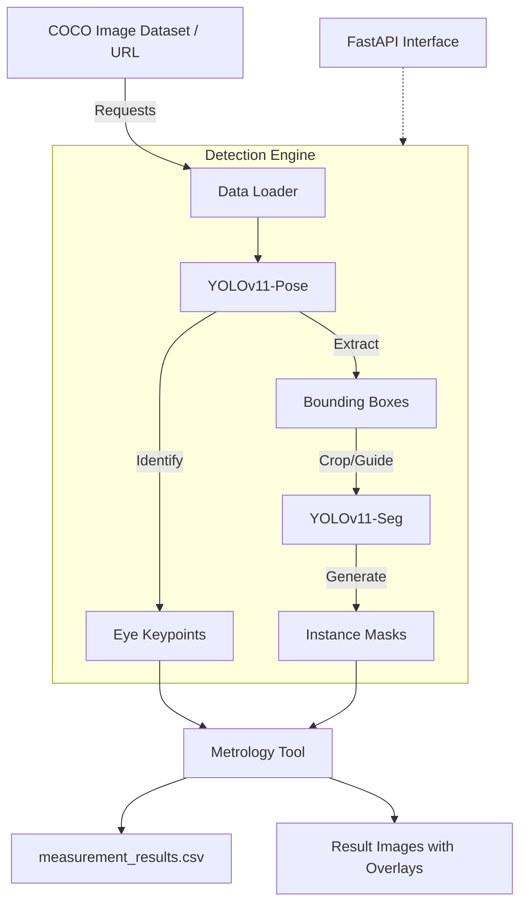

# Animal Metrology & Pose-to-Seg Pipeline 

這是一個基於級聯式深度學習任務（Cascaded Tasks）的自動化動物量測系統。系統先透過自定義訓練的 **YOLO-Pose** 模型定位關鍵點，再利用 **YOLO-Seg** 進行局部輪廓分割，實現精確的生理特徵量測。

## 核心功能
- **自動化篩選**: 從 COCO 資料集中自動篩選包含特定數量目標且「無人」(包含兩隻貓以上)的純淨樣本。
- **級聯偵測**: Pose 帶動 Seg，利用邊界框 (BBox) 引導分割模型，提高複雜背景下的輪廓準確度。
- **精密量測**: 自動計算雙眼距離 (Eye-to-Eye) 與跨個體間距。

## 技術棧
- **核心框架**: Ultralytics YOLO11 (Seg), Ultralytics YOLOv8n (Pose), PyTorch
- **影像處理**: OpenCV, Pillow
- **數據處理**: Pandas, NumPy, Scikit-learn
- **進度追蹤**: tqdm

## 快速開始 (Inference)
- 用 COCO 資料集 , 挑出有兩隻貓(含或以上)的圖片
- 用 YOLOv8n-Pose 模型將動物的bbox及動物的眼睛標出
- 用 YOLO11n-Seg 模型將動物bbox中的輪廓找出
- 量測每隻動物的雙眼距離以及任意兩隻動物的右眼距離
### 0. 前置作業
不論是inference還是training，都需要用到kaggle的開源資料集，為了能下載kaggle資料集，請務必先到個人的kaggle帳號中取得金鑰(kaggle.json)，將其載下放到專案目錄中即可
* Get your own kaggle.json from Kaggle Settings.
  * Setting --> API Tokens --> Legacy API Credentials --> Create Legacy API Key
* Doenload kaggle.json.
### 1. 安裝環境
```bash
pip install -r requirements.txt
```
### 2. 環境設定
```bash
cp .env.example .env
```
### 3. 放置權重
請確保將訓練好的 best.pt 放入 weights/ 資料夾中。

### 4. 執行專案
```bash
python main.py
```

## 遷移學習 (Training)
實作中發現YOLOv8n-Pose主要是抓"人"的眼睛位置，並不會抓動物的眼睛，因此藉由animal pose資料集對YOLOv8n-Pose作transfer learning，獲得新的權重
### 1. 安裝環境
```bash
pip install -r requirements.txt
```
### 2. 環境設定
```bash
cp .env.example .env
```
### 3. 執行訓練
```bash
python train.py
```

## Docker 部署指令
本專案支援容器化部署，確保在任何環境下皆能有一致的執行結果：
### 1. 打包環境 (Build)：
```bash
docker build -t animal-metrology:latest .
```
### 2. 運行容器 (Run Container):
```bash
# 使用 GPU 進行加速 (需安裝 NVIDIA Container Toolkit)
docker run --gpus all -v $(pwd)/results:/app/results animal-metrology:latest
```

## API 服務說明
本專案整合了 FastAPI，可將量測引擎轉化為網頁 API 服務，支援多用戶遠端呼叫。
### 1. 啟動 API 伺服器
在終端機執行以下指令啟動服務：
```bash
python inference_API.py api
```
服務啟動後，API 文件（Swagger UI）將自動生成於：http://localhost:8000/docs

### 2. 身份驗證 (Authentication)
為了確保資源安全，API 採用 HTTP Basic Auth 驗證。
- 測試帳號: guest_user
- 測試密碼: animal_test_2026

### 3. 主要接口 (Endpoints)
**POST /v1/measure/batch - 啟動批次量測任務**
此接口會觸發完整流程：從 COCO 篩選圖片、執行 Pose 與 Seg 偵測，最後產出報表。
- 請求參數 (Query Parameters):
  - target_cat: 目標類別（預設 cat）
  - min_count: 每張圖最少含有的目標數量（預設 2）

- 回傳範例:
```JSON
{
  "status": "success",
  "processed_images": 5,
  "total_animals_detected": 12,
  "report_path": "results/measurement_results.csv"
}
```

### 如何在 Swagger UI 進行操作測試
1. 開啟瀏覽器並前往 http://localhost:8000/docs。
2. 點擊頁面右側的 "Authorize" 按鈕。
3. 輸入測試帳號 guest_user 與密碼 animal_test_2026 並點擊 Authorize。
4. 找到 POST /v1/measure/batch 區塊，點擊 "Try it out"。
5. 修改參數或直接點擊 "Execute"。
6. 向下捲動查看 "Server response"，若回傳 200 代表執行成功，你可以回到專案目錄的 results/ 資料夾查看生成的影像與 CSV。


### 系統架構圖
